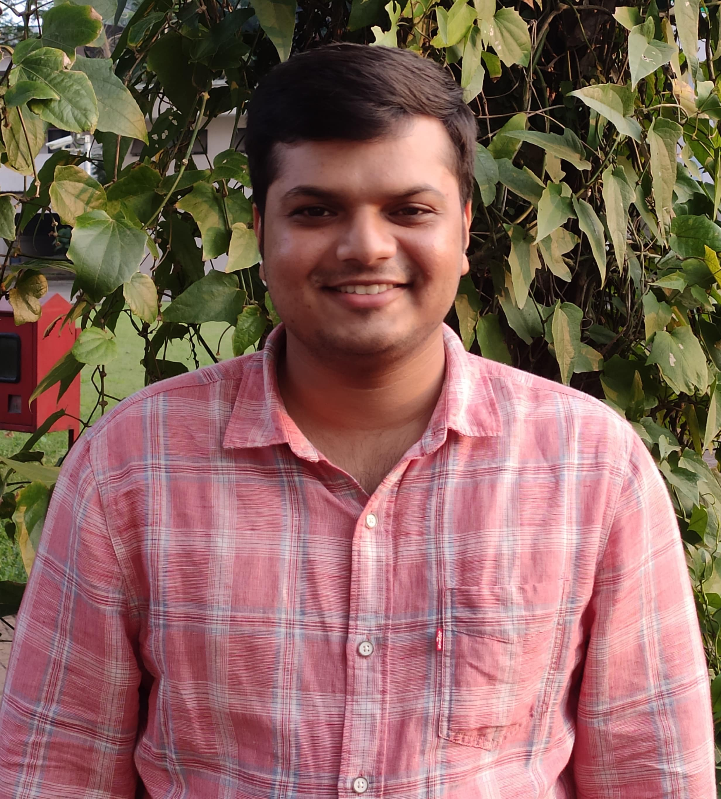

<!DOCTYPE html PUBLIC "-//W3C//DTD XHTML 1.0 Transitional//EN" "http://www.w3.org/TR/xhtml1/DTD/xhtml1-transitional.dtd">
<html>
<head>
<title>Shreyas Jagadeep Shete</title>
<link rel = "icon" href = "images\Shreyas_Sketch-Blue.png" type = "image/x-icon"> 
<meta http-equiv="Content-Type" content="text/html; charset=iso-8859-1" />

</head>
<body>

  

    

      
    

  

  

    

      <h2><a href="index.html">Shreyas Jagadeep Shete</a></h2>
      <h3></h3>
      
	  

       
      <h2><a href="https://www.linkedin.com/in/shreyas-jagadeep-shete-89a163b3" target="_blank">About Me</a></h2>
      <h3>Engineer|Researcher</h3>
      I am currently looking for a research opportunity in the field of Artificail Intelligence and Machine Learning. I have completed my under-graduation course in Electronics and Communication at Visvesvaraya Technological University(VTU). During this time, I greatly enjoyed courses such as Signal and Systems, Digital Signal Processing,Programming in C, Computer Communication Networks and Microprocessors & Controllers that allowed me to utilize my prowess in problem-solving to tackle complex problems. My final year thesis project titled "Smart Pregnancy Detection for Cow Using MATLAB" under the guidance of Associate Professor Prasanna Kumar C. I got to apply my knowledge of Digital Signal Processing and got a chance to learn and explore on machine learning. I am also proud of the fact that my work has been accepted and published under the same name in the peer-reviewed International Journal of Engineering and Science (IJES). Apart from this, As a RPA engineer at Novigo Solutions Pvt. Ltd., I got an opportunity to work and research in Cognitive Automation. To learn more on machine learning and to have strong foundation, I have taken up and acompleted a course on Machine Learning fron coursera. Now, with a strong foundation I want to explore more in the field of machine learning specifically in unsupervised learning and artificial intelligence specifically in computer vision for which I seek a full time research in this domain.
      
Resume: <a href="Resume\Shreyas_Jagadeep_Shete_Resume.pdf" target="_blank">[pdf]</a> More about me:  

       
    

    

      

        <ul>
          <li><a href="index.html">Home</a></li>
          <li><a href="publications.html">Publications</a></li>
          <li><a href="gallery.html">Gallery</a></li>
          <li><a href="contact.html">Contact</a></li>
		  <li><a href="blog.html">My Blog</a></li>
        </ul>
      

    

  

  

  

  

    

  

</body>
</html>
